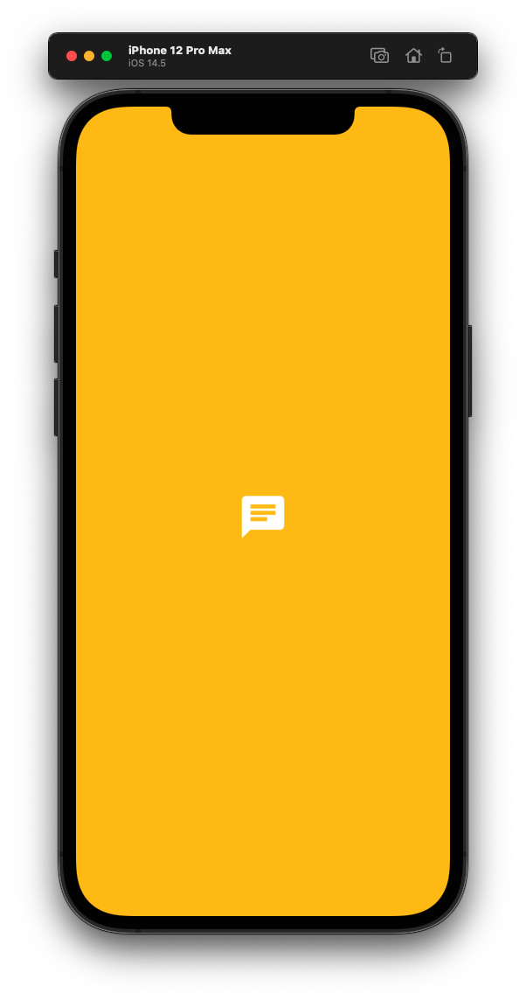
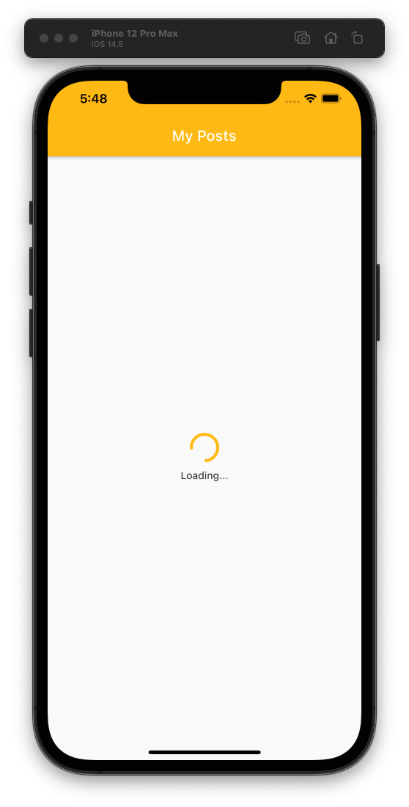
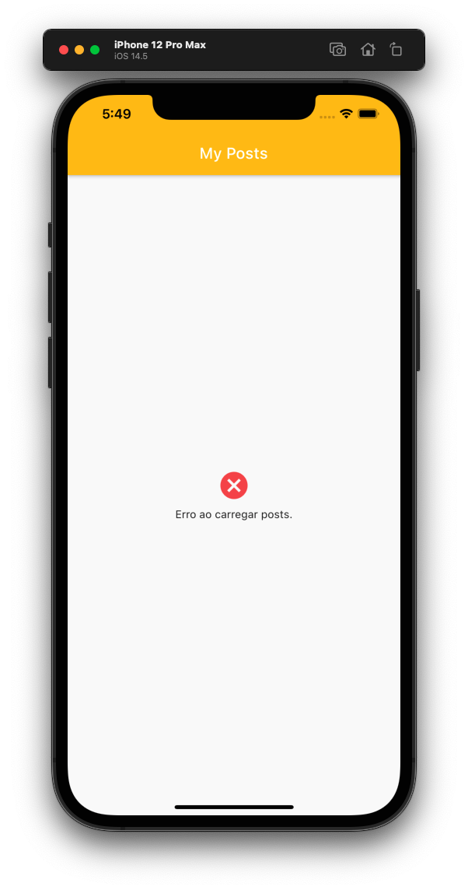
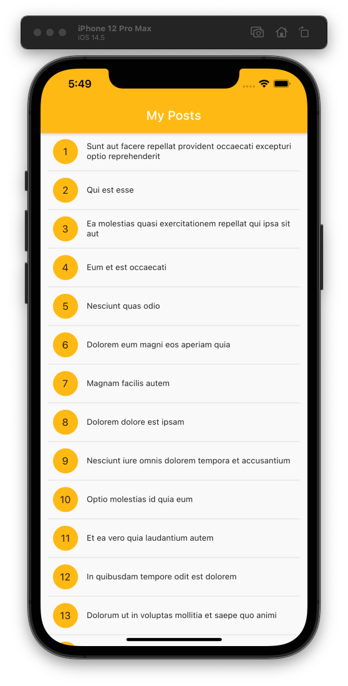

# LevelUP#4

Vamos solidificar o conhecimento sobre API Rest, usando [JSON Placeholder](https://jsonplaceholder.typicode.com/) para chamar os dados da API e mostrar eles na tela do nosso app!

## Screenshots
 

  
   

  
   

